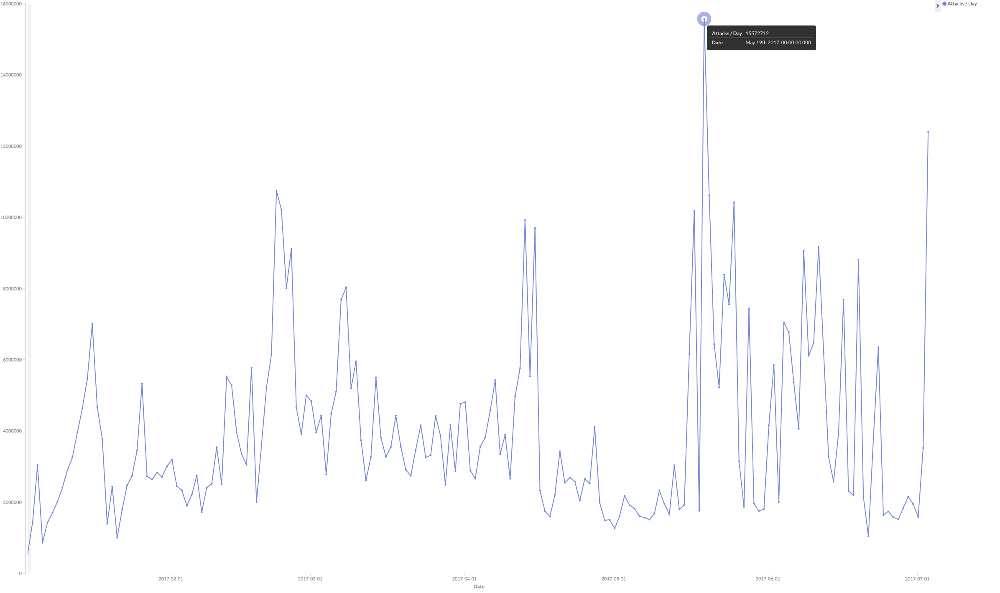
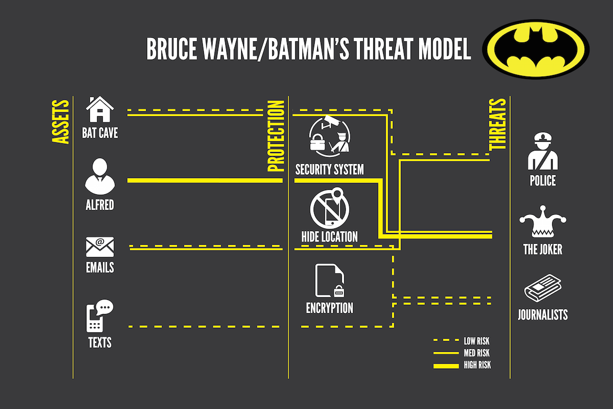

# with python: security() - Piotr Dyba


#### Disclaimers:
This article is my personal opinion and nobody is paying me for mentioning any of the open source or commercial products mentioned in this article, that focuses on developerperspective.


## What is cyber secuirty and why it's so important now days ?

Cyber security is means and protocols to defend your resources and devices (computer systems, IoT devices, smartphones) from disruption, damage or theft.
It is not only about firewalls and antivirus software, but it start with the hardware,
like policies for handling computers and servers at a company, 
accesses to server rooms and even up to what security should allow to bring to the company for example it is common no ban external pen drives.
When we can assume that our hardware is safe enough we need to harden our software on both workstations and servers and impose 
proper policies for the users, data handling, access.

[Data leaks in time](http://www.informationisbeautiful.net/visualizations/worlds-biggest-data-breaches-hacks/)

Researching leaks amount and severity over time it is easy to observe a huge increase in its amounts over the years and severity rising from 1 000 to above 1 000 000 000 user's data.


Remember that screen from just two weeks ago ? NotPetya laid waste on many companies across the globe in just one day, some of them are still recovering.
The most publicly known cases are companies like TNT and Raben.
Raben is a good example of well prepared recovery that took less than 24 hours and in that time moved whole server infrastructure from Windows to Linux, that was quite an achievement.



Graph shows a number of attacker per day in last 6 months so it varied from 2 to almost 16 millions per day. Attack means action against one of F-secure research honeypots deployed in public internet.
A honeypot is a server that pretends to be an easy target for an attacker where all his actions can be monitored, registered but most important it does not affect the critical parts of infrastructure it’s just a trap that exposes services like ssh, mysql, smtp etc. in our case written in pure python.


| O.No. | username | password  | count   |
|-------|----------|-----------|---------|
| 1     | root     | root      | 1165236 |
| 2     | admin    | admin     | 66522   |
| 3     | user     | user      | 23994   |
| 4     | test     | test      | 13302   |
| 5     | pi       | raspberry | 35938   |
| 6     | support  | support   | 35331   |
| 7     | ubnt     | ubnt      | 33170   |
| 8     | oracle   | oracle    | 9294    |
| 9     | guest    | guest     | 23524   |
| 10    | git      | git       | 10829   |

From those attack it was deducted that a lot of them are bots trying to login using few default username-password combinations. It leads to assumption they are sometimes succeeding, because if they were not that would stop scanning in such a manner.


## Threat modeling

And how we can approach that issue is Threat modeling is a process for analyzing the security of an application or a system.
It is a structured approach that enables you to identify, quantify, and address the security risks associated with the target of the modeling.

Lets do an example from Batman's perspective and lets identify our assets which are the bat cave, our butler Alfred and infatuation in form of emails and texts.
Next distinguish threats so the police, our arch enemy joker and the press.

Now lets quantify those threats. So Alfred is irreplacable and has access to all our other assets so he is our highest risk and highest prioritety for defense.
Our bat cave is also precious but it can be rebuilded.
Lastly information so Email and text messages that can allow us to be tracked where are we going or what do we do but we can handle the journalists and the police ourselves.

So for our main asset Alfred we can obscure his location and his identity which is not that easy in modern world. 
The bat cave is much simpler task because we can have security systems, traps, misleading bases of operations etc. there is a tone of possibilites here.
For emails and texts we can encrypt them and just be caution when writing something delicate should be enough.




So as in the batman example we can start with identifaying our assets and what is their purpose, so what are their use cases.
The next step is to specify entry points to that asset and then how it interacts wit external parts of the service or 3rd party services
The last step is defining the Access Control Lists or ACL for shortcut for example what is possible for anonymus user, registered user and admin to do.
If You already have been developing an application there I a high chance that part of you work is already done so You can reuse data flow diagrams or application UML.
Event better if You have behavioural or integration tests in place


There are few frameworks that we can work with like STRIDE (Spoofing identity, Tampering with data, Repudiation, Information disclosure, Denial of service, Elevation of privilege)
and ASF (Application Security Frame) both of them should give us a reliable outcome consisting of information regarding:
* Auditing and Logging
    * Auditing is used to answer the question "Who did what?" and possibly why.
    * Logging is more focused on what's happening.
* authentication and authorization
    * authentication is the a process of ascertaining that somebody really is who he claims to be
    * authorization is a procces to determine who is allowed to do what
* configuration management – so how and where do we are store configs
* data validation and protection in storage and transit
    * where do we store the data
    * where do we validate it before recording
        * backend side
        * both BE and FE side
        * only FE (is highly not advised)
    * Protection in transit
        1. basic approach: is to have all communication over TLS so encrypted
        2. advanced approach: is to have the data additionally encrypted before sending it and it is becoming corporate level security standard.
        3. expert approach: send over dedicated VPN tunnel, government level security.
* Last thing we need to worry about is Exception management – so how do we track exceptions occurrence and what are the procedures to handle them.

Now we just need to measure severity of the threats we have.  We can try approaching that by ourselfs determining what assets are the most important for us or use for example CVSS. The Common Vulnerability Scoring System is based on factors like attack vector, attack complexity which is hard to measure, privliges, user interaction, scope, confidentiality, integrity and availability. All together can give You a reference rating but if You are not sure about the value like in case of attack complexity try both and either make average or leave it as a range. It is important to remember that this is just a reference point, a tool to help not an oracle for what should you do.
As mentioned before if you have use case UMLs or even better abuse case UMLs they may come in handy here
And some of the tests can be done even at unitest level… if You are not having only happy path unitests.


We can address issues in 4 ways from completely remove the threat, reducing it, acknowledging it and do nothing or pretended there is no issue. Obviously Best options is removal of the threat but some times it is even impossible to remove it or the costs for removing are to high so we can try mitigate it. Taking the risk by leaving it as is or marking it as “to do”, maybe fine in some cases an example for that is when attacker is able to travers over a directory with long and random file names of non important pictures of other users cats. So there is a chance that someone will type some random gibberish and he will see the picture of other user cat but he will still don’t know whose cat is it and we don’t really care if that happens. But if the user can travers not only over cat pictures but also over config files etc. and we still do nothing about it then we are asking to be hacked.


## Common attack vectors on frontend application

So how can we hack our app? We can start from analysing it on our own but probably some one already thought about it.

Of course and it was not someone but thousands of people. There is a huge project called Open Web application Secuirty Project – OWASP in short. That is not only gathering all common threats but also have examples of attacks, measure their severity and much more. It can be used both by technical and less technical person like Project Manager as most of vulnerability have also a business level explanations. 

OWASP is much bigger source of knowledge then only threats, it consists information of tools, books events and other interesting sites. 

OWASP publishes a list of most common attack every few years there, last one is from 2013 and fresh one is coming up this years, but if You look on the last ones the changes are minimal over time which leads to sad conclusion that many people still do not learn on others mistakes.

OWASP TOP 10:
1. A1 Injection
2. A2 Broken Authentication and Session Management
3. A3 Cross-Site Scripting (XSS)
4. A4 Insecure Direct Object References
5. A5 Security Misconfiguration
6. A6 Sensitive Data Exposure
6. A7 Missing Function Level Access Control
8. A8 Cross-Site Request Forgery (CSRF)
9. A9 Using Components with Known Vulnerabilities
10. A10 Unvalidated Redirects and Forwards

so Broken authentication and session management,
cross site scripting…
this one is fun because it does not affect us directly but our users,
cross site scripting allows attacker to embed their script in to our webpage for example in comment that will not
affect our site but for example make our trusting users to download some malware… Security missconfiration,
missing ACLs, CSRF so who knows django… … … ?
Ok most of you rember that when using django template language you add CSRF tokens in forms right ?
So this is the reson for doing so atackers cannot abuse your forms that easly. If You are not adding them you should…

I can try all of them and more using on of the projects.
[BeeBox project](https://sourceforge.net/projects/bwapp/files/bee-box/)
[OWASP Broken Web Applications Project (OWASP BWAP)](https://www.owasp.org/index.php/OWASP_Broken_Web_Applications_Project)


## Common attack vectors on python application

Attacker can try injection code in to our Python Application. It won’t happen unless they found a new loophole in Python itself and we are not using at all eval/exec or pickle especially form user input.

Example of Python payload (not in one line for readability)
```python
import subprocess
subprocess.Popen([
	'/bin/bash',
	'-c',
	'rm -rf --no-preserve-root /'
])
```

SQL injection… Also we are quite safe here unless we are using our own SQL engine instead of mature ORMs like SQLalchemy or djangoORM.

Example of SQL payload:
```SQL
admin; DROP DATABASE users;
```

The main threat to a Python application is located between chair and keyboard… the developer.
Good thins is that, it can be mitigated that also to a point, using security static code analysis which are described later on.
If you are interested in how to exploit pickle there is a link that can explin that really good with example on an already fixed bug in Twisted framework.
[Exploiting pickle](https://blog.nelhage.com/2011/03/exploiting-pickle/)

But why people would even use eval or exec if it is so dangerous ?

```bash
python2 -m timeit -s 'code = "a,b =  2,3; c = a * b"' 'exec(code)'
10000 loops, best of 3: 18.7 usec per loop
```

```bash
python2 -m timeit -s 'code = compile("a,b =  2,3; c = a * b", "<string>", "exec")' 'exec(code)'
1000000 loops, best of 3: 0.664 usec per loop
```

```bash
python3.5 -m timeit -s 'code = "a,b =  2,3; c = a * b"' 'exec(code)'
10000 loops, best of 3: 22.3 usec per loop
```

```bash
python3.5 -m timeit -s 'code = compile("a,b =  2,3; c = a * b", "<string>", "exec")' 'exec(code)'
1000000 loops, best of 3: 0.544 usec per loop
```

It can make simple script much faster on python 2.7 ~30 (18.7usec vs. 0.664usec) times and what is interesting over 40 times faster on python 3.5 (22.3usec vs. 0.544usec).

Eval may simplify code. A known example of string calculator shows that really well.

String calculator:
```python
def count(equation):
	a, sign, b = equation.split(' ')
	a, b = int(a), int(b)
	if sign == '+':
		return a + b
	elif sign == '-':
		return a - b
	elif sign == '*':
		return a * b
	elif sign == '/':
		return a / b
	else:
		return 'Unsuported sign'

print(count('2 + 3'))
```

String calculator using only eval:
```python
print(eval('2 + 3'))
```

From 12 lines of code for the most basic example of a equation it can be reduced to just one line using eval which will work with even more complex equations.

## Threat Model of a simple blog app

#### Specification

A threat model of a simple app using AngularJS for front end Sanic for backend with SQL database with few simple endpoints like:
* /                 - static home for serving the JavaScript and HTML parts
* /api/login        - dedicated authentication endpoint
* /api/blog         - blog list view
* /api/blog/<id>   - detail post view
* /api/user         - user list view
* /api/user/<id>    - detail user view

#### Use-cases to understand how the application is used

So lets get back to our Blog app So we have only 3 basic uses cases for our app:
Everyone can enter site and view blog and blog posts.
Registered users can add new posts
Admins can manage users and delete posts


#### Identifying trust levels – Access Control Lists

| user type | Login | Logout | Read Blog | Write blog | Delete blog | Manage Users |
|-----------|-------|--------|-----------|------------|-------------|--------------|
| Anonymous | Yes   | No     | Yes       | No         | No          | No           |
| User      | No    | Yes    | Yes       | Yes        | No          | No           |
| Admin     | No    | Yes    | Yes       | Yes        | Yes         | Yes          |

#### Interactions with external entities

| DB Action | Login | Logout | Read blog | Write blog | Delete blog | Manage Users |
|-----------|-------|--------|-----------|------------|-------------|--------------|
| DB Read   | Yes   | No     | Yes       | Yes        | No          | Yes          |
| DB Write  | No    | No     | No        | Yes        | No          | Yes          |
| DB Delete | No    | No     | No        | No         | Yes         | Yes          |

#### Identifying entry points

| Method | /   | /api/login | /api/blog | /api/blog/<id> | /api/user | /api/user/<id> |
|--------|-----|------------|-----------|----------------|-----------|----------------|
| GET    | Yes | No         | Yes       | Yes            | Yes       | Yes            |
| POST   | No  | Yes        | Yes       | Yes            | Yes       | Yes            |
| DEL    | No  | No         | No        | Yes            | No        | Yes            |


| User type | / | /api/login | /api/blog | /api/blog/<id> | /api/user | /api/user/<id> |
|-----------|---|------------|-----------|----------------|-----------|----------------|
| Anonymous | G | P          | G         | G              | -         | G              |
| User      | G | -          | GP        | GP             | -         | G              |
| Admin     | G | -          | GP        | GPD            | GP        | GPD            |

G - Get | P - Post | D - Delete

#### Identifying assets

Lets think a little bit about what is the most precious thing we have in our app… In case  of blog it is information so our users and blog posts
How can they be affected?
Access elevation to a registered users or even an admin.
direct attack against our database
denial of service attack
and full ownage of the server which is as bad as it sounds
Our second most valued asset may be our code base
which can be targeted in different ways than the information it self by
adding some malicious  code
getting open sourced or our code being sold
gaining  even read only access will allow attacker to find easily vulnerabilities and exploit them
We can loos the control of our version control system


So for our Front end we can expect six of OWASP top 10,

A2 Broken Authentication and Session Management
A3 Cross-Site Scripting (XSS)
A5 Security Misconfiguration
A7 Missing Function Level Access Control
A8 Cross-Site Request Forgery (CSRF)
A10 Unvalidated Redirects and Forwards


We are using a well know framework, which is really good unless we or our developrs do something stupid becouse AngularJS mitigates or even handles all of those issues.


The last step of threat modeling is adressing:
To avoid elevating privileges to admin level
We can add two or multi factor authentication for at least Admins, and restrict access to admin panel for certain IPs or IP ranges
Before a bot or a unwanted user starts spamming we can
Limiting post per day, edits per hour, adding  Shorter sessions and adding captcha will definitly mittagte thos issues

#### Addressing issues

Someone gets admin access and deletes all.
Adding multi factor authentication for at least Admins.
Someone gets user access and creates spam or spreads malware.
Limiting post per day, edits per hour. Shorter sessions.


We already identified our endpoints when we designed our simple blog app and on prevous slide we add use cases now lets think about Interactions, and access control lists. Lets project what we know on Database interactions so Login action can only read from DB, Logout does not event need to read anything from the database, reading blog does only require read access and so on. Important fact is that only admin can manage users and delete blog posts so we can quite easily defend against losing the data, just by that.

(Get Post Delete)
Lets think about our database actions on API layer and focus on Get Post Delet methods shown in two tables. We know we can disable del and post methods for home, and for login we can only accept post method. The rest endpoint specification will depend on the projects approach to creating proper endpoints so it may differ to the example shown on the slide. 

At this point we have complited all points of the Decomposition phase of threat modeling. Now lets move to second part. 


Part of mitigation is also having proper testing at unitests level.


sshttp - hiding SSH servers behind HTTPhttps://github.com/stealth/sshttp


OK so we got hacked, but how bad is it for us ? There are 5 circles of shame to measure that. The first one is the worst so being hacked by script kiddie or a bot that’s the level where people start rethinking their carrier choices… It bad really bad, but only a little less bad is being hacked by one of OWASP top 10s... Then being hacked by other well documented vulnerability is of cours still bad and still it needs to be fixed ASAP. Least but not last getting owned by new and shinny vulnerability that is out there and the knowledge and awerness is not yet high enough is obviously bad for business but at least not that shamefull. Lastly being hacked by unknown publicly vulnerability, as it is still not good for buissness at the same time show how serius the attackers needs to be and how your defences where good anought to draw him or her to the last resort he or she had. In cases 1-4 especially 1 and 2 you can except a lot of information on the net how easy were you hacked. For the fifth circle attacker will try to keep his ways a secret as long as possible, so You may not even see a fallback in the press about it.
Just lets keep in mind that attack may be not destructive at all and after attackers success he may be doing only invisible actions like gathering the data or some increasing trolling. Of course he may also install some nasty ransomware and demend a high ransom.
Gartner reported last year that on average it takes 200 days for a company to notice that they have been hacked. 200 days imaging what can attacker do during that time.


### Tooling

Source Code Analysis (Reading thought the abstract syntax tree and looking for possible security bugs) tools:
* Bandit – tool designed to find common security issues in Python code, it is writen in Python and it can be easily extended with You own security policies. It works in similar manner to pylint or pep8 tool. You can get it directly from PyPi.
* SonarQube – more advanced then bandit it has ready plugin for Jenkins and it support also JS, HTML and 20 other languages. The tool has integrated web ui and many more useful features. You can spawn your own instance or buy it as a service. Jenkins read - “Continuous Inspection”.

Automatic Scanning tools:
* ZAP (Zed Attack Proxy) – Free, Open Source, Jenkins ready 
Zap is open source alternative to burp which is developed under OWASP project and it already has dedicated Jenkins plugin.
* Burp – Free/Paid, Jenkins ready in ~2017
Burp can Scan for vulnerabilities, Intercept browser traffic and Automate custom attacks, it does not have Jenkins plugin yet but it was announced that this Year something should be ready for continues development.
both of them can be also used manually so You can define you own attack patterns and payloads.
* Metasploit – Free, OpenSource, Jenkins ready
* SQLMap - Free, OpenSource

scapy - Free, OpenSource, Pythonif want to test a custom implemented protocols You will probably need to use scapy which is a python library for preparing dedicated TCP, ICMP  packages  and UDP Datagrarms.

Commercial solutions and managed services:
There are few well known commercial solutions and even managed services. The advantage of the service approach is quite nice as You are getting only report that does not consists of False Positives resoult from the scans. There are three major players in this filed: Nessus, Qualys and F-Secure Radar.
* Qualys
* Nessus
* F-Secure Radar


## Useful terminology

#### Penetration Testing

A penetration test is an authorized attack on a system, application and/or infrastructure.
The reasoning behind undergoing pentesting is quite obvious find security weaknesses or to fulfilling a compliance needed by 3rd party.
There are usually two main objectives for a pen tester to achieve: get privileged access and/or obtain restricted information.
Even when having on site pen testing team it is still recommended to use a 3rd party company.
Penetration tests should be considered before major releases or periodically after a longer development cycle,
in best case scenario automated security tests using for ex. Zap are also in place.

Penetration tester is a person who performs a penetration test.
They can also be called by: Pentester, Hacker, White Hat or Security consultant, just remember not to call them Black Hat or Cracker which basicly means criminal and will make them really sad and You do not want that to happen.

There are tree major approaches when pen testing white, grey and black box.

White box means full transparancy and full access for pen tester to our production systems especially:
* Pentester has full access to the application and systems he is testing.
* Test covers widest range of attack vectors.
* Pentester has access to the source code and documentation.
Greybox narrows the access, but still requires source code and sometimes developer instance before starting the main pen test,
the pen testing becomes targeted and works within boundaries:
* Pentester does not have access to the system.
* Pentester has different types of accounts like user and/or moderator, but not application admin level access.
* Pentester has access to the source code and documentation.
Black box, as the name suggests limits access, so the pentesters perspective is the same of a real attacker by restricting access:
* The Pentester does not have knowledge about the system or knows only basics about it.
* No access to source code, but obtaining the source code may be one of the steps when executing an attack our be one if its goals.
* No initial access to the app above end user level.


#### CISO

Chief Information Security Officer is a person responsible for
* Computer security/incident response team
* Disaster recovery and business continuity management
* Identity and access management
* Information privacy
* Information regulatory compliance PCI, Data Protection Act, GIODO in Poland
* Information risk management
* Security architecture and development so process and tools
* IT Security
* Security awareness in the company.
* Managing pentest and red teamings.

#### Red Teaming

A red Teaming drill is an attack usually on many layers against a company that only CEO, CISO or CTO are aware of. Red Teaming Exercise may consist:
* Physical security testing like breaking into the office, server rooms, conference room, planting bugs or lock picking.
* Network and IT security testing done by for example planting raspberryPI on the net, routing data through sniffer or leaving behind some rubberducky.
* Phishing and social engineering.
* Software pentesting.
If the red timing finishes undetected, that means company that under went the test has huge security problems as the Attacker during
the drill after achieving all goals starts being “noisy” till a point someone should have notice…


### Bibliography and follow up recommendations

* [owasp.org](http://owasp.org)
* [vulnhub.com](https://vulnhub.com)
* [awesome-security](https://github.com/sbilly/awesome-security)
* [pentest-wiki](https://github.com/nixawk/pentest-wiki)

* [safeandsavvy.f-secure.com](https://safeandsavvy.f-secure.com/)
* [reddit.com/r/netsec/](https://reddit.com/r/netsec/)
* [blogs.cisco.com](https://blogs.cisco.com/)
* [youtube.com/channel/UClcE-kVhqyiHCcjYwcpfj9w](https://youtube.com/channel/UClcE-kVhqyiHCcjYwcpfj9w)
* [gynvael.coldwind.pl](http://gynvael.coldwind.pl/)
* [nakedsecurity.sophos.com](https://nakedsecurity.sophos.com/)
* [risky.biz](https://risky.biz/netcasts/risky-business/)
* [badcyber.com](https://badcyber.com/)
* [packetstormsecurity.com](https://packetstormsecurity.com)
* [labs.mwrinfosecurity.com/](https://labs.mwrinfosecurity.com/)
* [ctftime.org](https://ctftime.org/ctf-wtf/)
* [overthewire.org](http://overthewire.org/wargames/)
* [picoctf.com](https://picoctf.com/)
* [microcorruption.com](https://microcorruption.com/)
* [offensive-security.com](https://www.offensive-security.com/when-things-get-tough/)
* [Batman threat modeling](https://mobilisationlab.org/wp-content/uploads/2015/08/batman-threat-model-1200.png)

* Justin Mayer's talk from EuroPython 2017: "Replacing passwords with multiple factors: email, otp, and hardware keys"


### About author

Piotr Dyba is a Team Leader and software engineers at F-Secure’s Rapid Detection Service where he and
his Python team are developing a distributed network of honeypots, network sensor and tooling for RDS.
In my spare time he is a leading mentor and a teacher at the PyLadies Poznan.
Pythonally in love with asyncio and personally with hiking.
The last interesting fact about Piotr is that he used to be a photojournalist with and vistied Afghanistan as war photographer.